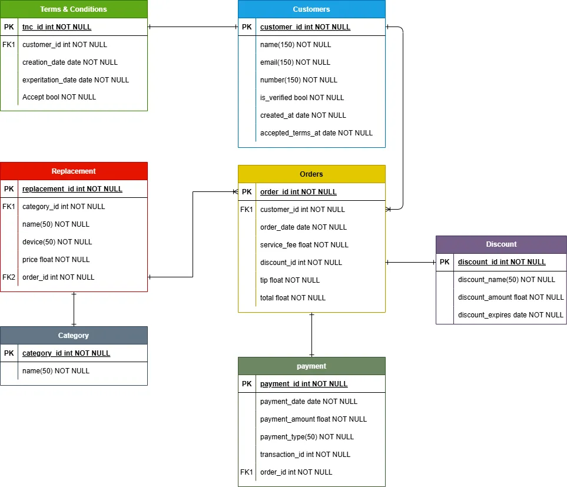

# MERN for Business

## 📚 MongoDB ExpressJS React NodeJS

### Description

Welcome 🖖🏼 this is a web application that allows the business to send Accept and condition froms to clients to start ordering process.

#### ⚙️ Functionalities

- Userfriendly interface.
- Database to keep track of the customers who had accepted the terms and conditions.
- JWT to send personalized links to clients.

##### Database

The database contains the following entities:

- Terms & Conditions (TnC)
- Customers (Users)
- Replacements
- Category
- Orders
- Discount
- Payment
  
